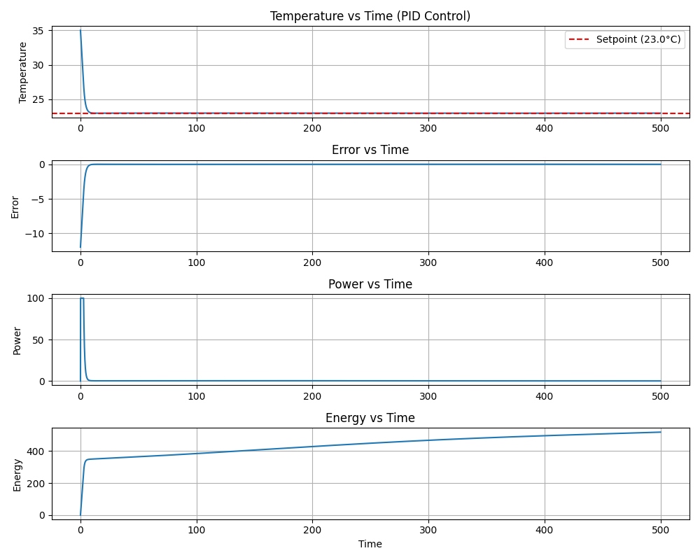

# AC PID Autotuner

AC temperature PID controller simulation with Twiddle-based auto-tuning.

## What it does
- Simulates a first-order thermal plant with sinusoidal ambient disturbance
- Auto-tunes Kp, Ki, Kd using the Twiddle (coordinate ascent) algorithm
- Minimises a cost function balancing tracking error and energy consumption
- Plots temperature, error, power, and energy over time
## Simulation Output

## Requirements
- Python 3.x
- matplotlib

## Install & Run
pip install matplotlib
python ac_pid_autotuner.py

## Optimised Gains (example at 23°C setpoint)
- Kp = 2.655
- Ki = 0.096
- Kd = 0.563
- Final cost = 298.16
